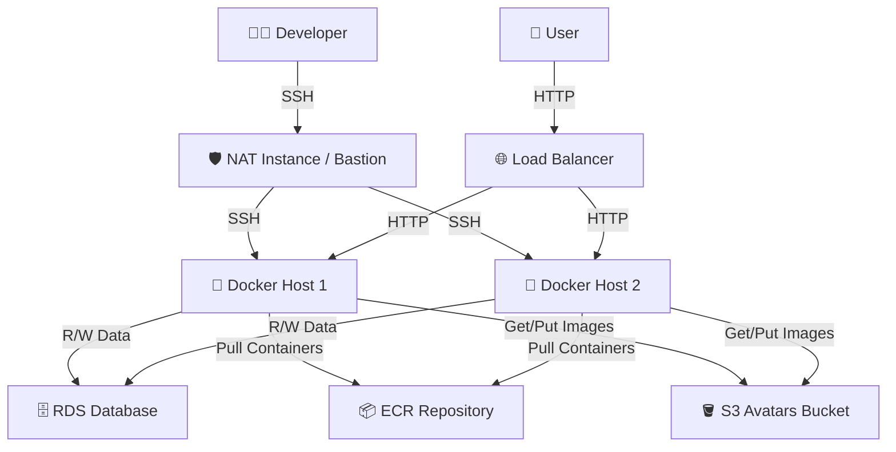
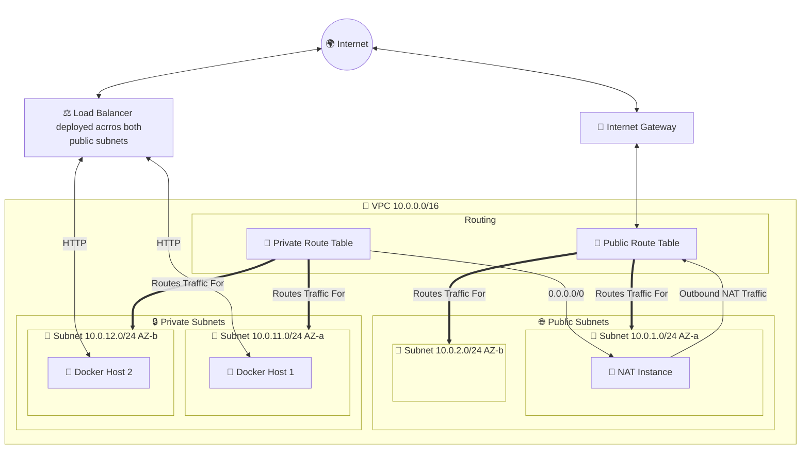
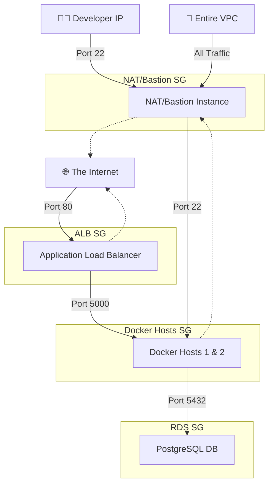
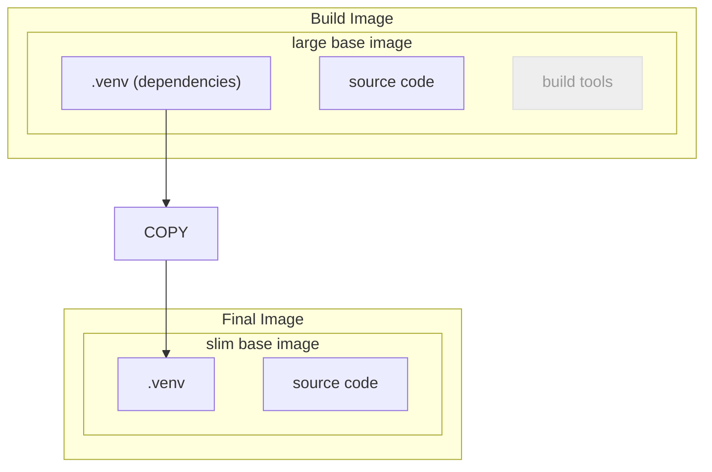
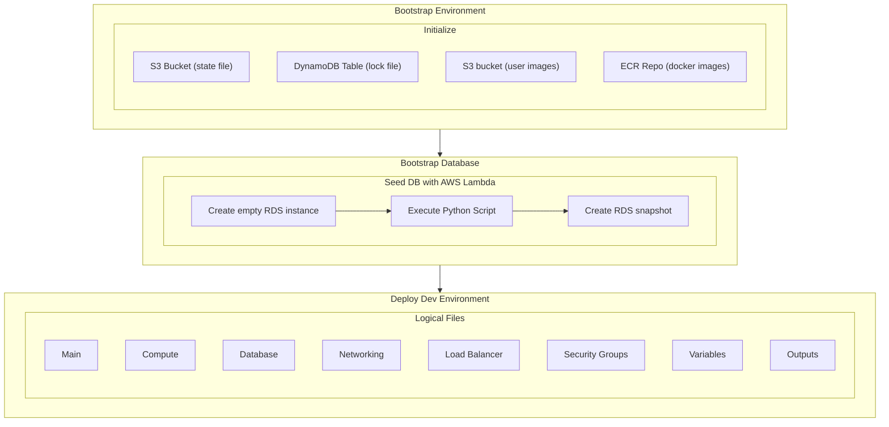

# MarketMate

> More documentation at the upstream repository:  [AWS_grocery](https://github.com/AlejandroRomanIbanez/AWS_grocery)
 
## Educational project to learn devops topics 
- Cloud: [Amazon Web Services (AWS)](#amazon-web-services-aws)
- Containerization: [Docker](#containerization-docker)
- Infrastructure as Code: [Terraform](#infrastructure-as-code-terraform)

## Summary

MarketMate is an educational e-commerce platform based on the Python Flask and Javascript React Framework. The goal of the project was to deploy a development environment for the e-commerce platform on AWS. It was implemented by packaging the app in a docker container, deploying it on two EC2 instances in private subnets behind a Load Balancer und connecting them to a RDS PostgreSQL instance in a private subnet group. Container Images are pulled automatically from an ECR repository and user images are stored in a S3 bucket. An additional instance acts as a NAT instance to allow internet access for the docker host and as a jump box to allow SSH access to the docker hosts. The usage of Terraform to define the infrastructure as code simplifies the creation and destruction of the development environment.

## Amazon Web Services (AWS) 

### Overview
- three EC2 compute t3.micro instances with latest Amazon Linux 2023 AMIx86-64
    - two configured as docker hosts
    - one configured as NAT instance / bastion host 
- RDS database t3.micro instance configured by loading a snapshot
- Application Load Balancer with basic blocklist and target group containing the docker hosts
- S3 object storage bucket 
- ECR container registry repository

### Compute

All three instances are configured with a startup script. The scripts are passed to the instances on start up and executed after boot. On a docker host the script installs Docker, pulls the application image and runs it. Environment variables are passed on to the application in the container as command line variables. On the NAT instance the script enables IP forwarding, installs iptables and configures the firewall to let the NAT instance act as a router with network address translation (NAT).

### Networking

Overall the architecture tries to resemble a production environment by implementing a multi-tier setup. For this a custom virtual private network (VPC) is created spanning two availability zones (AZs) with a public and private subnet in each AZ. A Load Balancer (LB) is deployed across both public subnets and forwards HTTP requests to the Docker hosts. Each Docker host lives in a private subnet. The RDS PostrgreSQL instance lives in a subnet group that spans both private subnets. The NAT instance needs to be in a public subnet.

#### Route Tables
Each subnet has to be linked to a route table. For this a public and a private route table is created. The private route table routes internet traffic through the NAT instance. The public route table routes internet traffic to the internet gateway.

#### Security Groups

Security groups act as external firewalls. They enforce the principle of Least-Privilege for both incoming and outgoing traffic. Instead of specifiying IP addresses as allowed traffic source, it is also possible to specify other security groups as source. For this a security group for every network device is created and then used to allow traffic where needed limited to the required ports.

### Permission Management
The docker hosts consume resources of other AWS services. They need to download the docker image from the ECR repository and they need to be able to read and write to an S3 bucket. For this an Identity and Access Management (IAM) role is created and the required IAM policy is attached to the docker hosts.

For managing the infrastructure for this project access to the AWS command line interface (AWS CLI) is necessary. The recommended way of using AWS CLI is with AWS Single Sign On (AWS SSO, now called AWS IAM Identity Center). Mainly designed for organisations, it is also possible to enable an account instance of IAM Identity Center for a single user account. The process is described [here](/docs/aws_sso.md). The advantage of this method is that only a temporary session token is saved locally and not any long-term credentials.

## Containerization: Docker
To simplify the deployment of the app, it is deployed as a Docker container. The container gets build from the latest app version on the developer machine and is then pushed to the container repository (ECR) on AWS. The commands to build, tag and run a container are documented [here](/docs/docker.md).

To build the container a two stage system is implemented. The first stage pre-compiles the python files and creates a virtual environment (vendor dependencies). The second stage starts with a smaller base image and then the app files and the prepared virtual environment to run the app get copied into the base image. This process is documented in the [Dockerfile](/backend/Dockerfile)

## Infrastructure as Code: Terraform

### Overview

Infrastructure as Code (IaC) allows to provision and manage infrastructure through automated scripts. For this project the most popular IaC software tool named Terraform was chosen. It uses a declarative language called HCL to define the desired state of the infrastructure. The Terraform executable is used to implement the changes to achieve the desired state.

#### Main advantages
- infrastructure creation is completely automated
- configuration changes are transparent through version control and easily reversible

#### General sequence of commands to create infrastructure with Terraform
1. terraform init: init project
2. terraform plan: checks your configuration against the current state and generates a plan
3. terraform apply: applies the plan to create or update your infrastructure, creates the state file
4. terraform destroy: removes resources, when no longer needed

### IaC specific features
- self-managed state file backend (AWS)
- environment secrets stored in separate 'terraform.tfvars' file 
- uses AWS as data source for:
    - latest Amazon Linux 2023 image version
    - current AWS region
    - account ID
    - AWS ECR repository
    - AWS S3 bucket (user images)
    - public ip of developer
- uses local variables for instance user_data
- added console output for testing:
    - load balancer dns name
    - docker host 1 private ip
    - docker host 2 private ip
    - nat instance public ip
- ALB listener rule to block the most common malicious patterns to keep the log clean
- HCL code split up in logical units

### Implementation

To set up the required infrastructure with Terraform a multi-stage process is required. The first bootstrap stage creates the initial AWS environment for Terraform and the Docker container, the second bootstrap stage creates a snapshot of the PostgreSQL database, which is then used in the last stage to deploy the complete development environment. All required steps and console inputs are documented [here](/docs/deployment.md).

After the third stage is completed, four values are displayed in the console output.
- load balancer dns name
- private IP address of docker host 1
- private IP address of docker host 2
- public IP address of NAT instance

The public ip address of the NAT instance can be used together with a private IP address of a docker host to access the docker hosts via SHH. The load balancer dns name can be used to access the MarketMate online shop.