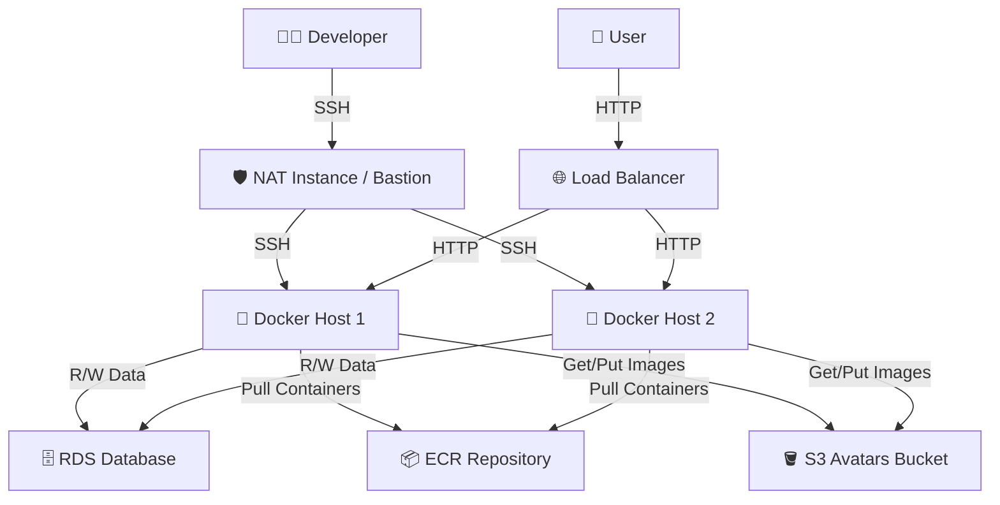
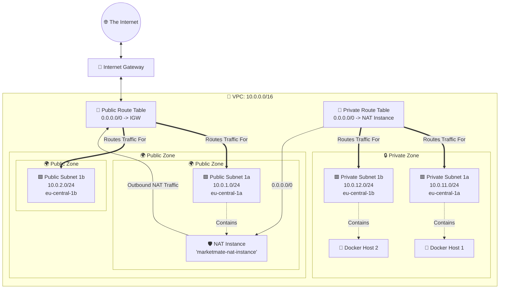
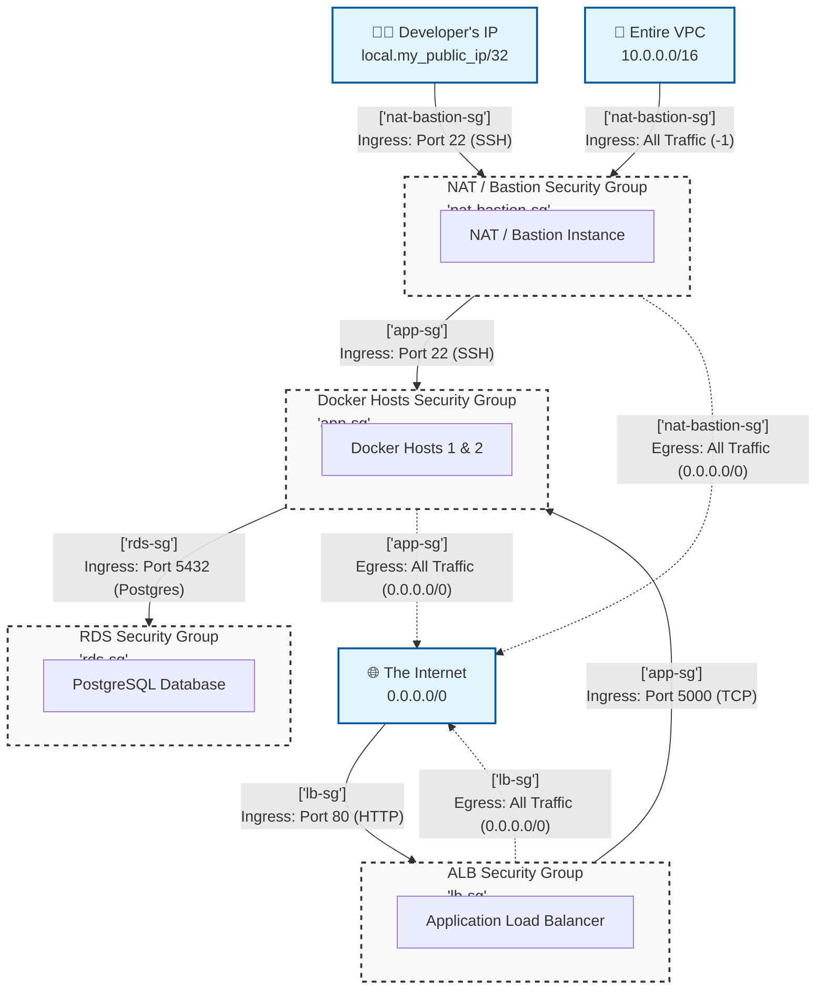

# MarketMate

> More documentation at the upstream repository:  [AWS_grocery](https://github.com/AlejandroRomanIbanez/AWS_grocery)
 
## Educational project to learn cloud topics 
- [AWS infrastructure](#aws-infrastructure)
    - EC2
    - S3
    - RDS
    - DynamoDB
    - ECR
- [Docker](#docker)
- [Terraform](#terraform)

## Summary

MarketMate is an educational e-commerce platform based on the Python Flask and Javascript React Framework. The goal of the project was to deploy a development environment for the e-commerce platform on AWS. It was implemented by packaging the app in a docker container, deploying it on two EC2 instances in private subnets behind a Load Balancer und connecting them to a RDS PostgreSQL instance in a private subnet group. Container Images are pulled automatically from an ECR repository and user images are stored in a S3 bucket. An additional instance acts as a NAT instance to allow internet access for the docker host and as a jump box to allow SSH access to the docker hosts. The usage of Terraform to define the infrastructure as code simplifies the creation and destruction of the development environment.

## AWS infrastructure

### Overview
- three EC2 compute t3.micro instances with latest Amazon Linux 2023 AMIx86-64
    - two configured as docker hosts
    - one configured as NAT instance / bastion host 
- RDS database t3.micro instance configured by loading a snapshot
- Application Load Balancer with basic blocklist and target group containing the docker hosts
- S3 object storage bucket 
- ECR container registry repository

### Networking
- Custom VPC spanning two availability zones (eu-central-1a, eu-central-1b) with:
    - public subnets for the Application Load Balancer and NAT/Bastion instance
    - private subnets for the docker hosts
    - DB subnet group spanning both private subnets for the RDS instance
    - Each subnet has to be linked to a route table, and a subnet can only be linked to one route table. On the other hand, one route table can have associations with multiple subnets. Every VPC has a default route table, and it is a good practice to leave it in its original state and create a new route table to customize the network traffic routes associated with your VPC. 
    

- security groups:
    - docker_app_flask_sg
        - ingress: "5000/tcp/load_balancer_sg"
        - ingress: "22/tcp/net_bastion_sg"
        - egress: "all/-1/0.0.0.0/0"
    - nat_bastion_sg
        - ingress: "5000/tcp/0.0.0.0/0"
        - ingress: "22/tcp/{dev_public_ip}/32"
        - egress: "all/-1/nat_bastion_sg"
    - rds_sg
        - ingress: "5432/tcp/docker_app_flask_sg"
    - load_balancer_sg
        - ingress: "80/tcp/0.0.0.0/0"
        - egress: "all/-1/0.0.0.0/0"

### Permission Management
- IAM policies attached to the docker hosts:
    - S3 get/put/list
    - ECR read only
    - Systems Manager

## Docker

## Terraform